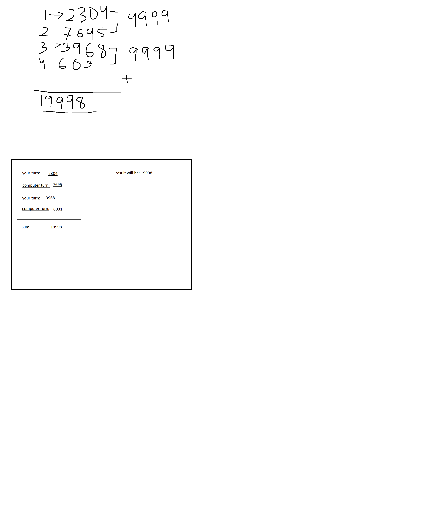

# home work

1. make a number guessuing game

2. make a birthday countdown 
   ask user birthday, and tell them how many months, days, hours, minutes and seconds left till next birthday.

   *user input:* 20th april
   *computer response:* your next birthday coming in 4 months or 3,151 hours or 189087 minutes or 11,345,234 seconds.

3. make an age calculator, ask user birth date and tell them how   old he/she is in years, months, days, hours, minutes, seconds.
update every second with setInterval function

*user input:* 20th april 1994
*computer response:* you age is 26 years, 7 months, and 19 days xx hours xx minutes xx seconds old. 
