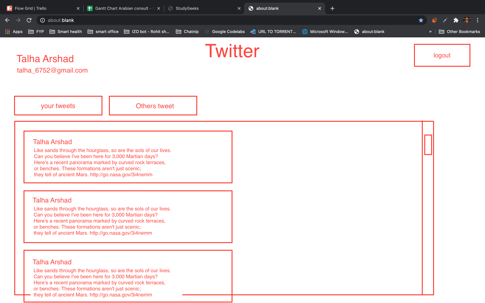

# Make a twitter application:

make a twitter like we applicationwith following features:

1) Signup: 
   - user will signup with email and password, 
   - you must save user password in mongodb database as bcrypt hash
   - if user is already exist with the given email ask user to use a different email 

2) login:
   - user will login thorgh email and password
   - you must use jwt
   - you must save token in http-only cookies (not in local or session storage)
   - you must genrate a new token on every request which will replace old token from http-only cookie
   - token should expire if user dont do any activity in 5 minutes
 
 3) forget password:
    - user should be able to reset their password incase they forget their password
    - user will enter their email in forget password form and should receive a otp (one time password) in their mailbox.   *hint: you may use postmark or nodemailer to send emails from server*
    - otp must be saved in database to keep the server stateless
    - otp should be saved as bcrypt hash instead of plain text
    - otp should expire if user do not use otp within 5 minutes
    - if user create another otp, the previous otp should be removed from database before creating a new one
    - once otp is used to reset password it should not be useable anymore, so remove otp from database once it is used to reset password

4. Dashboard: 
    - here is the wireframe of your dashboard:
    

    - a user should see their tweets and a user should also see others tweets with their name
    - new tweets should appear in realtime without refreshing the page   hint: you can use socket.io
    - once user click logout user should not be able to see any tweet including own tweet even if he goes back to the dashboard page
    - once user click logout user should be redirected to login page 

    

